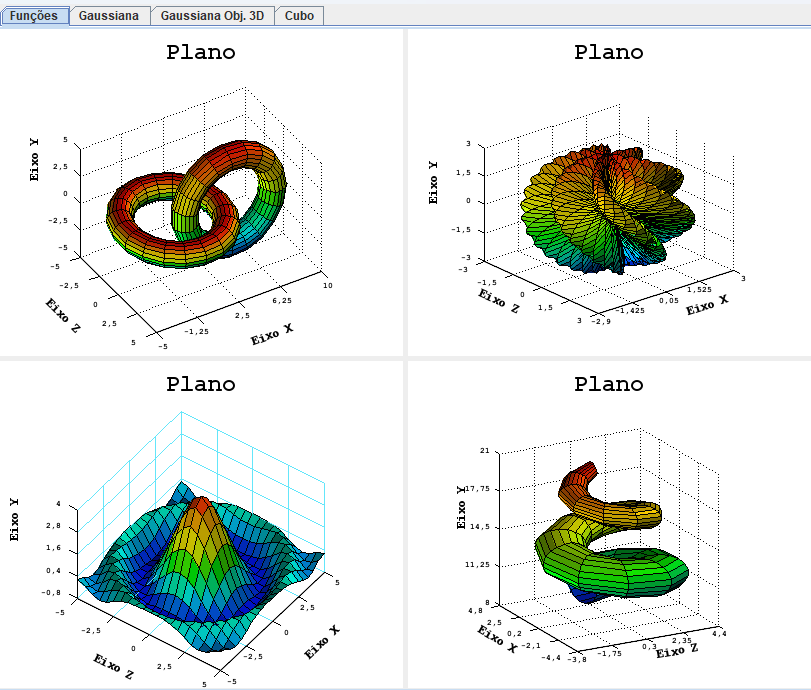

# Projeto iplot

Framework Java para desenho de funções ou gráficos em 2D e 3D



Para rodar o aplicativo embutido de demonstração do framework, basta baixar o arquivo iplot-1.5.jar e rodar executando o seguinte comando:

```
java -jar iplot-1.5.jar
```

Ou, se estiver no windows, pode dar dois cliques no arquivo iplot-1.5.jar.

| :zap: Obs, para funcionar depende do java 1.8 ou superior instalado na máquina  |
|---------------------------------------------------------------------------------|

Para mais detalhes, visite a página do projeto: https://www.italoinfo.com.br/projetos/iplot


